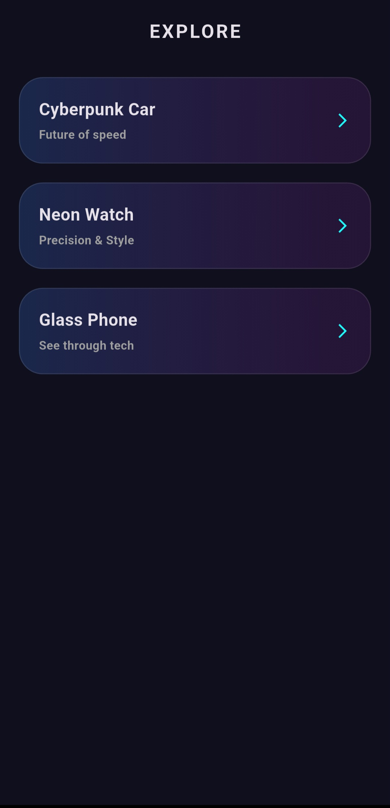
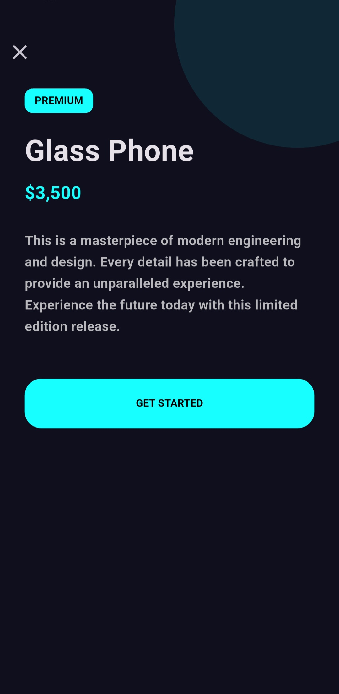

# Items App

A modern Flutter application structured with Clean Architecture principles. The app presents a stylized item catalog with a main listing screen and a detailed item view.

## Features
- Clean, dark-themed UI
- Item list screen with custom cards
- Detail screen for each item
- Smooth navigation between screens
- Clear separation between presentation, domain, and data layers

## Architecture
This project follows a Clean Architecture approach:
- `core` for shared app configuration and theming
- `domain` for entities, repositories, and use cases
- `data` for models, data sources, and repository implementations
- `presentation` for UI pages and reusable widgets

## Project Structure
- `lib/main.dart` — app entry point
- `lib/src/core/` — theme and shared configuration
- `lib/src/domain/` — business entities and use cases
- `lib/src/data/` — local data source and repository implementation
- `lib/src/presentation/` — UI screens and widgets

## Tech Stack
- Flutter
- Dart

## 📸 Screenshots

  
  

